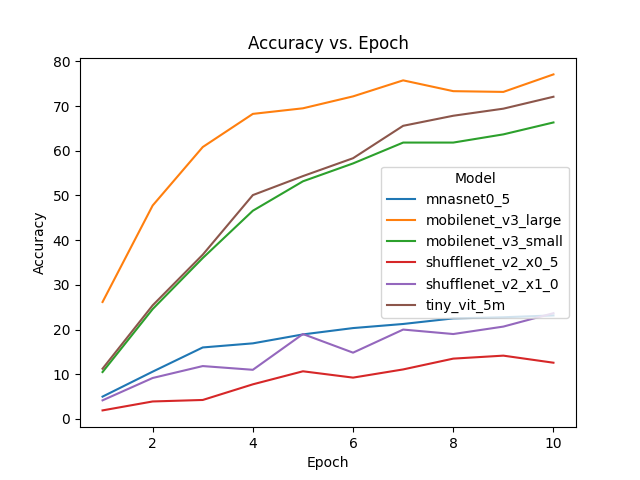

# DS5110 - Team 11

## Alex Kendrick, Casey Nguyen, Grant Hanley

## Introduction
Computer vision is an important task in machine learning. Many models used for computer vision tasks are large and expensive to train.Transfer learning with small models can mitigate some of the barriers to entry for computer vision tasks. With transfer learing the base model structure is already defined and fine tuning existing weights is often less expensive than training them from scratch. Smaller models may lack the capacity of larger, more complex models but having less weights to train reduces overall training cost. We seek to benchmark some of the lightest weight models readily available on Pytorch to gauge their effectiveness.

## The Data
### Source and Description
The data used for benchmarking the models is the [Stanford Dogs Dataset](http://vision.stanford.edu/aditya86/ImageNetDogs/). The dataset consists of 20,580 images of 120 dog breeds collected from around the world. The images come from ImageNet, they are stored in jpeg format and have varying dimensions. The file structure of the data aids in defining the class of the images. Each class has it's own subdirectory with that classes images stored inside. In addition annotation files are available for each image, they describe the images class as well as other metadata including bounding boxes for the dogs in the images.

### Pre-processing
The first step of data pre-processing was moving the data to Amazon AWS into an S3 bucket. The create_S3_bucket notebook demonstrates how to create a new S3 bucket. When moving files into S3 we wanted to preserve the file structure of the data on the S3 bucket, so we could not use the web interface for AWS. Instead file structure can be preserved using the AWS CLI. The following command can transfer files and subdirectories to an S3 bucket while maintaining the structure:
`aws cp -r Images/ s3://mybucket`

If you have not already set up the AWS CLI you may need to configure it on your machine. Instructions for configuring AWS CLI are [available here](https://docs.aws.amazon.com/cli/latest/userguide/cli-authentication-user.html#cli-authentication-user-get). If you are using the class account you should already have an IAM user and so you will just need to create access keys for your user and then run `aws configure`.

After storing the data in S3 a custom dataset was created to load the data from the S3 bucket into the sagemaker instance and get it ready for processing. Two different modes were configured for loading the data. The first assumes all data was copied from the S3 bucket into the local sagemaker instance ahead of time. It attempts to find the images locally. The second mode grabs the images from the S3 bucket ad hoc. The first method is quicker when grabbing images for the dataset but has an upfront cost of moving all the data into the sagemaker instance initially. The second option is slower during training but avoids the need for storing all the images locally at once.

After loading the images they are cropped according to the bounding boxes specified in the annotations and have the dimensions normalized to 224x224. Additional images augmentations and transformations were omitted during this experiment to facilitate a common baseline for benchmarking.

## Training
Six models were explored for benchmarking:
| Model | # of Parameters | Size (MB)|
| ----- | --------------- | -------- |
| mnasnet0_5 | 2218512 | 8.87 MB |
| mobilenet_v3_large | 5,483,032 | 21.93 MB |
| mobilenet_v3_small | 2,542,856 | 10.17 MB |
| shufflenet_v2_x0_5 | 1,366,792 | 5.47 MB |
| shufflenet_v2_x1_0 | 2,278,604 | 9.11 MB |
| tiny_vit_5m | 5,110,284 | 20.44 MB |

For the purpose of comparing apples to apples during benchmarking no image augmentation was employed and the same set of hyper-parameters were used for all models during training. All models had the inital weights set from IMAGENET1K_V2 (except tiny_vit_5m). All layers had their weights made trainable. The loss function used for training was cross entropy loss. Training was done on a ml.c5.9xlarge virtual machine instance. The hyper-parameters were set to the following:
* Epochs - 10
* Learning Rate - 0.0001
* Optimizer - Adam
* Batch Size - 32

## Results

After 10 epochs mobilenet_v3_large had the best validation accuracy,  followed by tiny_vit_5m, and then mobilenet_v3_small. A key point to note is that while mobilenet_v3_validation accuraccy looks to have leveled off at 10 epochs tiny_vit_5m is still improving. We expect for a longer training run the tiny_vit_5m model would surpass accuracy from mobilenet_v3_large.

The was a wide gulf in the validation accuracy between the top 3 models and the bottom 3: mnasnet0_5, shufflenet_v2_x0_5, and shufflenet_v2_x1_0. These models were not able to effectively classify these images given the relative similarity between classes.

This makes the performance of mobilenet_v3_small impressive given how it vastly outperformed the other similarly sized models.

We were able to efficiently and cheaply finetune all these models. On a ml.c5.9xlarge instance the training times ranged between roughly 6 to 15 minutes. The total training time for all of these models was under 54 minutes which comes out to $2.19 at current prices.

| Model | Epoch | Avg. Epoch Time (s) | Total Time (s) | Instance Cost ($) |
| ----- | ----- | --------------- | ---------- | ----------------------- |
| mnasnet0_5 | 10 | 49.833820 | 491.716955 | 0.334368 |
| mobilenet_v3_large | 10 | 62.981959 | 635.080132 | 0.431854 |
| mobilenet_v3_small | 10 | 38.047777 | 381.454163 | 0.259389 |
| shufflenet_v2_x0_5 | 10 | 37.958277 | 378.224960 | 0.257193 |
| shufflenet_v2_x1_0 | 10 | 42.846457 | 429.733469 | 0.292219 |
| tiny_vit_5m | 10 | 89.025998 | 902.711765 | 0.613844 |

### Future Experiments

For future improvements for this project we could implement a save local function in the __getitem__ function of the custom dataset class. This could incrementally cache images as they are pulled from S3 if they are not already saved locally. It could be interesting to benchmark the performance difference between this and grabbing the images from S3 everytime they are used.

Finetuning hyperparameters for each models individually to see if they could eke out additional performance would be interesting. Sagemaker experiments could be a good framework to explore this further. Implementing a learning rate scheduler to see if it could improve these models is also an option.

Benchmarking these models on other fine-grained image classifications to see if they perform similarly could also be interesting. Some possible datasets are the [Stanford Cars](https://www.kaggle.com/datasets/jutrera/stanford-car-dataset-by-classes-folder) or [Oxford 102 Flowers](https://www.robots.ox.ac.uk/~vgg/data/flowers/102/).

We could also explore additional image augmentation. It would be interesting to see if it reduces overfitting the data with this task.