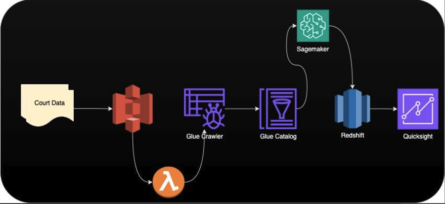

# 
**Big Data Systems Team 3 Project**

### 
Suraj Kunthu, Wyatt Priddy, and Atif Siddiqui

### **Introduction**

Court records data from was collected from both circuit and district courts across the Commonwealth of Virginia - home to the University of Virginia. Formed from existing real world court data, we are hoping to predict the outcome of misdemeanor and felony court cases within the general district court based on case type and demographics surrounding the defendant. 

### The Data

#### Source and Description

The full data set was sourced by [virginiacourtdata.org](https://virginiacourtdata.org/) and includes over 20 million rows of court cases from district and circuit courts from 2010-2020. 

We are using a subsection of the dataset for General District Criminal Courts from 2009 - 2020 regarding misdemeanors and felonies.

There are 7,196,322 data points across 11 variables being utilized:

|Variable|Description|Data Type|
|---|---|:---:|
|Final Disposition|The outcome of the court case.|str|
|Court|The court system within Virginia where the case was heard.|str|
|Complanaint|The arrest officers in the case.|str|
|Public Defender|Whether a public defender was assigned to the case|bool|
|Gender|Gender of the defendant|str|
|Race|Race of the defendant|str|
|Case Type|Indication of whether the case was a mideameanor or felony|str|
|Class|The level of misdemeanor or felony committed|str|
|CodeSection|A reference to the law that was violated — can be state or local law|str|
|ChargeAmended|Whether the original charge was amended|bool|
|SentenceTime|The duration of a jail or prison sentence from the outcome of the case|int|

#### Preprocessing and feature engineering:

##### Preproccesing:

The Race variable contained multiple variations of the different race types so a mapping function was applied to get succinct data.

The Class variable had null variables so we gave all null variables the status of "None" as not all charges have subclasses.

Code Section, or the charges applied, had 6 null variables. These were dropped from the dataset.

SentenceTime or the length of the sentence applied at the outcome of a case has null values so 0's were inputed as no sentence would have a length of 0. 

The results of the case, FinalDisposition, had a substantial amount of records (~89k) with null values. These were omitted from the dataset as this will likely be our response variable for a classification model. 

##### Feature Engineering:

The court variable was constructed from the FIPS code to indicate the court system that heard the case.

A new variable was created, ChargeAmended, to indicate whether a charge was changed from the original charge. This is usually done when an initial charge is too much of a far reach for the prosecutor and a lesser charge is needed to convict. 

Another new variable, PublicDefender, was created to indicate whether the defendant was assigned a public defender. 

### Experimental Design
Data Engineering focused project​
- Setting up ETL pipeline for data scientists​
- Compare query processes for optimal performance when working with Big Data

Measure Performance of big data reports based on the different file and compression formats supported by AWS​

- Load Data from Source to AWS S3 with different format and compressions ​
- Move the Data using AWS  and Crawlers into Redshift for Data reporting in a schematic Datawarehouse format.​
- Build Quicksight Reports for all file formats and measure Big Data report performance.​