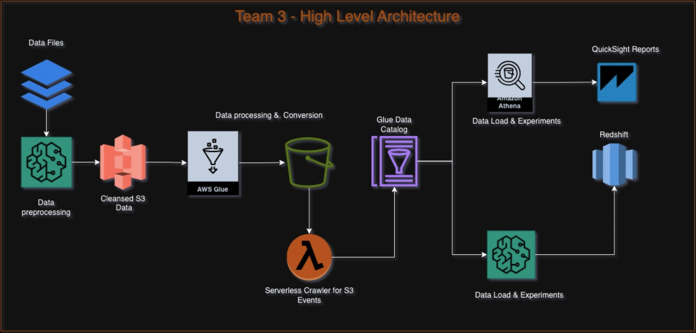
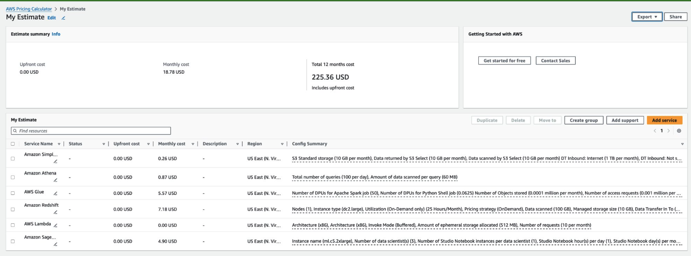

# 
 The ETL Data Pipeline

### 
Suraj Kunthu, Wyatt Priddy, and Atif Siddiqui

### 
**Team 3 Project**

#### 
 DS 5110: Spring 2024

## **Introduction**

We are working on a Data Engineering focused project​. Rather than create a Machine Learning model, we are setting up an ETL (Extract, Transform, Load) pipeline for data scientists​ to highlight the importance of **storage** and **organizing** data. We will compare query processes for optimal performance when working with Big Data sets and show the associated costs​.

## Importance of Storage and Organization

**Improved Performance:​**
- Faster query execution: Organized data with proper partitioning and indexing allows data processing tools to locate relevant information quickly, leading to faster query execution times.​
- Reduced processing overhead: Compressed data files require less storage space, which translates to less data to transfer and process during data pipelines. This reduces the overall processing overhead and improves efficiency.​

**Reduced Storage Costs:​**
- Efficient storage utilization: Organized data often eliminates redundancy and allows for optimized storage formats, significantly reducing the amount of physical storage needed.​
- Compression benefits: Compressed data files occupy less space, leading to lower storage costs on AWS services like S3. This is especially beneficial for large datasets.​
​
**​Enhanced Scalability:​**
- Easier data management: Organized data with clear structure facilitates adding new data or scaling existing datasets efficiently. This makes it easier to handle growing data volumes without performance degradation.​
- Cost-effective scaling: Lower storage requirements from compression allow for scaling your data processing pipelines with minimal impact on storage costs.​

**​Improved Data Quality:​**
- Reduced errors: Organized data structures help mitigate errors during data ingestion and processing due to inconsistencies or ambiguity.​
- Data validation: Organizing data allows for easier implementation of data validation checks to ensure the integrity and accuracy of your data before processing.​

## The Data

### Source and Description
The court records data from was collected from both circuit and district courts across the Commonwealth of Virginia - home to the University of Virginia. Formed from existing real world court data, we are hoping to predict the outcome of misdemeanor and felony court cases within the general district court based on case type and demographics surrounding the defendant. 

- the full data set was sourced by [virginiacourtdata.org](https://virginiacourtdata.org/) and includes over 20 million rows of court cases from district and circuit courts from 2010-2020. 
- We are using a subsection of the dataset for General District Criminal Courts from 2010 - 2020 regarding misdemeanors and felonies.
- ~93 different files Merged together used for feature engineering
- There are 7,196,322 data points across 11 variables being utilized:

|Variable|Description|Data Type|
|---|---|:---:|
|Final Disposition|The outcome of the court case.|str|
|Court|The court system within Virginia where the case was heard.|str|
|Complanaint|The arrest officers in the case.|str|
|Public Defender|Whether a public defender was assigned to the case|bool|
|Gender|Gender of the defendant|str|
|Race|Race of the defendant|str|
|Case Type|Indication of whether the case was a mideameanor or felony|str|
|Class|The level of misdemeanor or felony committed|str|
|CodeSection|A reference to the law that was violated — can be state or local law|str|
|ChargeAmended|Whether the original charge was amended|bool|
|SentenceTime|The duration of a jail or prison sentence from the outcome of the case|int|

### Preprocessing and feature engineering:

#### Preprocessing:

The `Race` variable contained multiple variations of the different race types so a mapping function was applied to get succinct data.

The `Class` variable had null variables so we gave all null variables the status of "None" as not all charges have subclasses.

`CodeSection`, or the charges applied, had 6 null variables. These were dropped from the dataset.

`SentenceTime` or the length of the sentence applied at the outcome of a case has null values so 0's were inputed as no sentence would have a length of 0. 

The results of the case, `FinalDisposition`, had a substantial amount of records (~89k) with null values. These were omitted from the dataset as this will likely be our response variable for a classification model. 

#### Data Cleaning Highlights:​

`Final Disposition`:​
- The response variable for a potential classification model had ~89k records with null values representing 1.2% of the dataset. These values were removed from the dataset. ​

`SentenceTime`:​
- The response variable for a regression model had ~447k records with null values representing 6.2% of the dataset. 0 values were input to represent no sentence time for the case. ​

`Charge` *Class*:​
- The *Class* feature had numerous entries (~2.4 million) with null values. It is not always applicable that a charge has a class therefore a value of "*None*" was inputed for these values. 

#### Feature Engineering Highlights:

`Court` Variable: ​
- Distinction by court was given in the Federal Information Processing Standard (FIPS) format. Supplemental data from the Federal Communication Commission was used to map FIPS code to court name​
- Example Conversion: *"51540"* -> *"Charlottesville City"​*

`ChargeAmended` Variable:
- A new variable was created, `ChargeAmended`, to indicate whether a charge was changed from the original charge. This is usually done when an initial charge is too much of a far reach for the prosecutor and a lesser charge is needed to convict. 

`Public Defender` Variable:​
- Manipulation of free-form text entry of the `Defense Attorney` field in the raw data to discern whether a defendant was assigned a public defender.​
- Example Entries: *"Public Defender", "Public Def", "P Def", "Pub Def", "PD"*

## ETL Pipeline

|Data Preprocessing| SageMaker / Notebooks| Clean and Merge source files|
|-|-|-|
|Data Processing|Glue|Job to Compress and Load data into  different File formats|
||Glue Crawlers|Schema definition for all different formats​|
||Lambda|Execute Automated crawlers whenever S3 event is created​|
||Athena|Read data from S3 and Glue Catalog​|
||Redshift Spectrum|Read data from S3 as external objects​|
||Redshift|Load data into different formats for experimentation​|
||SageMaker / Notebooks|Experimental Analysis|
||QuickSight|Dashboard  for Result visualization​|
​
## Experimental Design
Measure Performance of big data reports based on the different file and compression formats supported by AWS​

|Format| File Extension (optional)| Extensions for compressed files|
|-|-|-|
|Comma-separated values​|.csv|.gz, .snappy, .lz4, .bz2, .deflate​|
|Microsoft Excel workbook​|.xlsx​|No compression support​|
|JSON (JSON document and JSON lines)​|.json, .jsonl​| .gz​, .snappy​, .lz4​, .bz2​, .deflate​|
|Apache ORC​|.orc| .zlib​, .snappy​|
|Apache Parquet​|.parquet​|.gz, .snappy​, .lz4​|
[source](https://docs.aws.amazon.com/databrew/latest/dg/supported-data-file-sources.html)

### Experiment
For the tables created, execution time was retrieved from CloudWatch Logs​.

AWS Athena was leveraged to query different compression formats in S3 buckets​
- 3 READ queries performed of varying record sizes, 3 times each:​
  - 10 records <-- (ex: `head` or `tail` of data)​
  - 10,000 records <-- (ex: sampling)​
  - All records <-- (ex: full data query)​
- Query times (seconds) and Data Scanned (MB) was recorded​

Data was then averaged, exported as a .csv, and loaded onto QuickSight for visualization

[Link to QuickSight Dashboard](https://us-east-1.quicksight.aws.amazon.com/sn/accounts/211125778552/dashboards/df177a27-eeaf-4861-ab23-9bd5c4da0aec/sheets/df177a27-eeaf-4861-ab23-9bd5c4da0aec_9cee886f-53d0-4865-9995-c78eaa190ebc)

## Results

### Data Compression

Source Data Size after data cleaning and preparation - 1 GB

| Data Format​ | Compression​ | Comp S3 Size​| Redshift Size​ |
|-|-|-|-|
|csv| gzip|​ 63 MB| 388 MB​|
|csv|​snappy​|129 MB​| 360 MB​|
|json|gzip|78 MB​|224 MB​|
|json​| snappy​| 80 MB​| 224 MB​|
|orc​| snappy​| 54.5 MB​| 210 MB​|
|orc​| zlib​| 41.1. MB​| 224 MB​|
|parquet​| gzip​| 38.7 MB| 224 MB​|
|parquet​| lz4 | 50.4 MB​| -- |
|parquet​| lzo​| 49.9 MB​| --​|
|parquet​| snappy​| 50.3. MB​| 220 MB​|
|parquet​| zstd​| 39.1 MB​| 210 MB​|

- Lz compression is not supported with Athena  for Csv and Json​
- Redshift Deflates the data and then stores it in its cluster – Until Unless column level compression is defined.

### Athena Query
#### Table Creation

- .json.lz takes the longest at 52.9 seconds
- .snappy.parquet takes the shortest at nearly 0 seconds

#### 10 Records
Graphs of Trials

- One interesting note, trials do vary on both the amount of data scanned and query times.
- .snappy.parquet tends to have the most volatility on data scanned

Graphs of Average Data Scanned & Read Query Time

- For 10 records, .csv.snappy is the most ideal format for the read time/data scan ratio
- 0.44 MB read in 0.74 seconds
- NOTE: .lz compression is not supported by AWS Athena

#### 10,000 Records
Graphs of Trials

- Again, .snappy.parquet tends to have the most volatility on data scanned

Graphs of Average Data Scanned & Read Query Time

- For sampling data with 10,000 records, .json.gzip is the most ideal format for the read time/data scan ratio
- 0.47 MB read in 0.77 seconds

#### All Records
Graphs of Trials

Graphs of Average Data Scanned & Read Query Time

- For retrieving all records, .orc.zlib is the most ideal format for the read time/data scan ratio
- 41.05 MB read in 17.86 seconds

#### Query Costs

Cost of 1 Read, 100 Reads, 1000 Reads per day

- For 1000 reads per day, .parquet.gzip is the most cost effective format for Athena READS
- $5.58 for 38.5 MB read for 1000 reads/day

1000 Reads per day of Aggregated Format

- For 1000 reads per day, the apache ORC format tends to be most cost effective format for Athena READS
- Aggregate cost is $13.85 for 96.51 MB read for 1000 reads/day

### Project Cost

- Monthly cost: $18.78/month
- Project annual cost: $225.36

## Conclusion

### Athena & S3
**Data format and Compression​**
- Select appropriate data formats (e.g., Parquet, ORC) and compression types (e.g., Snappy, Zstandard) based on your data characteristics and query patterns.​

**​Organize Data in S3​**
- Organize data in Amazon S3 using partitioning and bucketing techniques to improve query performance and reduce query costs.​

**​​Define Schema​**
- Define the schema for your data in Athena either through AWS Glue Data Catalog or by creating tables using CREATE TABLE AS queries.​

**​Optimize Query Performance​**
- Optimize query performance by leveraging partition pruning, predicate pushdown, and column projection to reduce data scanned by queries.​

**​Optimize Data Access Patterns​**
- Optimize data access patterns by using AWS Glue Crawlers, updating partitions, and leveraging the AWS Glue Data Catalog for metadata management.​

**Monitor and Analyze**
- Monitor and analyze query performance using AWS CloudWatch metrics and Athena query execution plans to identify bottlenecks and areas for optimization.​

### Redshift
**Data format and Compression​**
- Choose Data Format and Compression: Select appropriate data formats (e.g., CSV, Parquet) and compression types (e.g., GZIP, ZSTD) based on your data characteristics and query patterns.​

**Load Data (Glue, COPY, Python)​**
- Load Data to Amazon Redshift: Load data into Redshift using preferred methods such as COPY command, INSERT statements, or Glue from S3 for large datasets.​

**Optimize Data Distribution & sorting​**
- Optimize Data Distribution & Sorting: Utilize appropriate distribution and sort keys (DISTKEY, SORTKEY) to optimize data distribution and storage on Redshift.​

**Analyze and Regular Vacuum​**
- Perform Regular Vacuum and Analyze: Schedule regular Vacuum and Analyze operations to reclaim disk space and update statistics for query optimization.​

**Optimize Query Performance (Tuning)**​
- Optimize Query Performance: Fine-tune and optimize queries for better performance, including indexing, query structure, and data distribution strategies.​

**Monitor and Analyze** 
- Monitor and Analyze Query Performance: Continuously monitor query performance metrics and analyze query execution plans to identify bottlenecks and areas for improvement.​​

## Appendix

S3 Bucket

Athena Query

Redshift

QuickSight Dashboard

SageMaker
