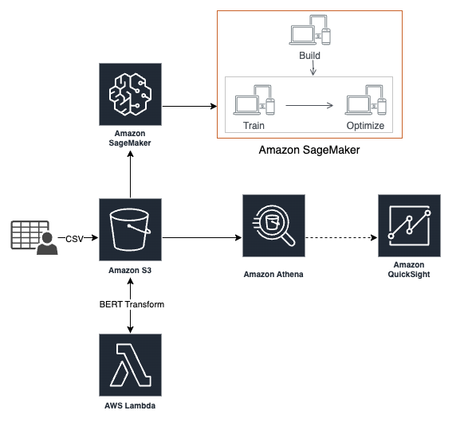
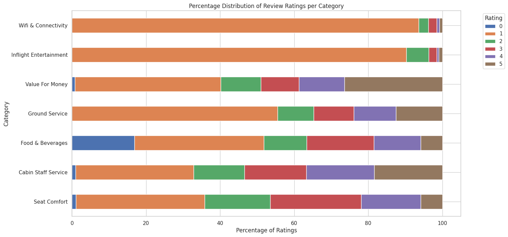
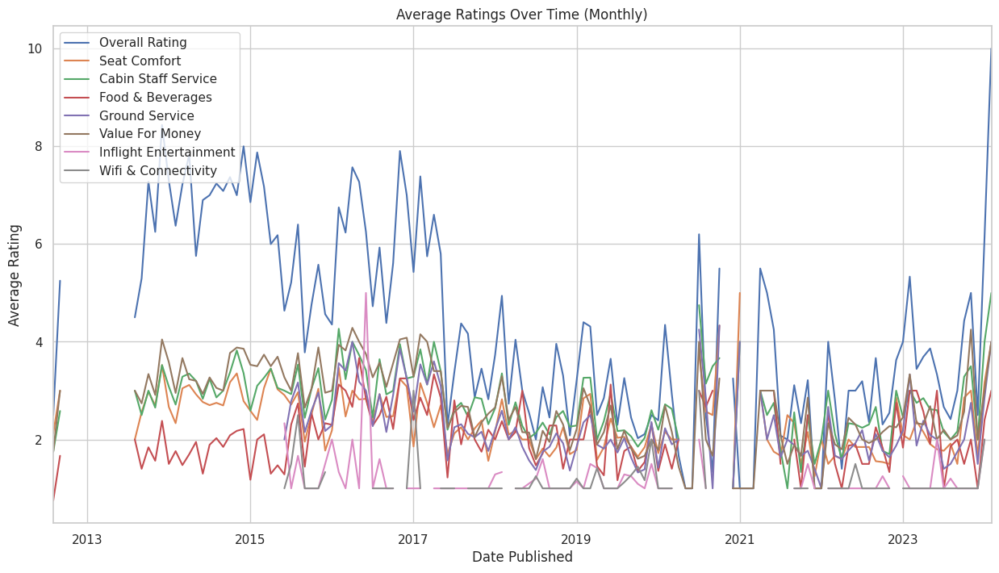

# Ryanair: Better Service through AI​

### Team 4 Members:
* Matt C. Scheffel
* Shrikant T. Mishra
* Daniel E. Kiss

## Introduction
Predicting customer satisfaction by analyzing historical customer feedback involves leveraging data analytics and machine learning techniques to gain insights into customer sentiments, preferences, and areas of concern. This proactive approach allows businesses to anticipate future issues, enabling them to react promptly and enhance overall customer experience.​

For this project, our team used AWS to process, analyze, and build a model that would accurately predict customer recommendation by looking Ryanair customers in reviews.​

We utilized AWS and the Ryanair dataset to determine if there are other insights that can be generated to help improve customer experience.​

## Dataset
Ryanair – Passenger Experience Reviews​: https://www.kaggle.com/datasets/cristaliss/ryanair-reviews-ratings

* CSV source file​
* 2249 records, 21 columns​
* Flight data from 2012-2024​
* Various useful metadata e.g., "Seat Type", "Inflight Entertainment", "Wi-Fi & Connectivity"​

Dataset Columns:  
* Date Published
* Overall Rating
* Passenger Country
* Trip_verified
* Comment title
* Comment
* Aircraft
* Type Of Traveller
* Seat Type
* Origin
* Destination
* Date Flown
* Seat Comfort
* Cabin Staff Service
* Food & Beverages
* Ground Service
* Value For Money
* Recommended
* Inflight Entertainment
* Wifi & Connectivity

## Process
Our team will process, analyze, and build predictive models that can accurately predict ratings given customer experience reviews.​

We will also utilize AWS and the larger dataset to determine if there are other insights that can be generated to help Ryanair improve customer experience.​

## Architecture

## Data Pre-processing
* No outliers were identified/removed​
* Transformed raw customer feedback to BERT embeddings by performing:​
    * Tokenization​ - Break raw text into tokens (words, sub-words, or characters).​ BERT typically uses WordPiece tokenization.​
    * Vocabulary Creation​ - BERT has a fixed-size vocabulary of common tokens.​ Tokens not in the vocabulary are split into sub-word units.​
    * Token ID Mapping​ - Map each token to a unique integer ID in the BERT vocabulary.​
    * Special Tokens​ - Add special tokens ([CLS], [SEP]) to indicate sentence boundaries.​
    * Padding and Truncation​ - Adjust tokenized text to fit BERT's fixed input length.​
    * Attention Mask​ - Create a mask to indicate which tokens are words and which are padding.​
 
## EDA
### Comparative Overview of Airline Service Ratings

### Key Terms and Rating Correlations in Airline Reviews

### Trends in Airline Service Quality Over Time

## Training and Testing
* Used pre-trained BERT model and measured train/val/test loss and accuracy
* Fit Random Forest classifier and generated permutation importance metrics (sklearn)

## Results

## Conclusion
* 10 labels is a more complex task than 2​
* Reviews tend to be polarized​
* Maximizing customer satisfaction is important​
* Next steps: identifying customer pain points in comment text​

## AWS Cost Analysis

