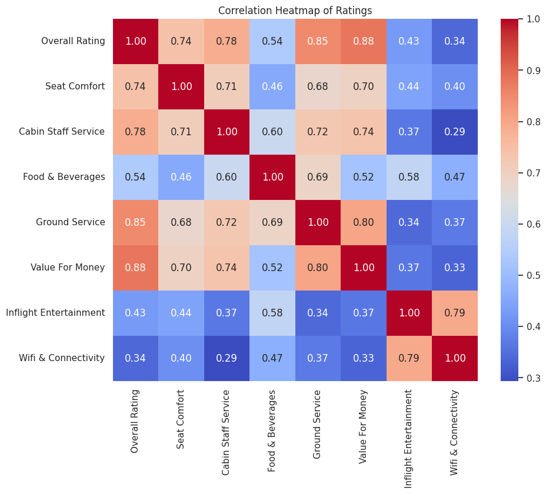

# Ryanair: Better Service through AI​

### Team 4 Members:
* Matt C. Scheffel
* Shrikant T. Mishra
* Daniel E. Kiss

## Introduction and Problem Statement
Predicting customer satisfaction by analyzing historical customer feedback involves leveraging data analytics and machine learning techniques to gain insights into customer sentiments, preferences, and areas of concern. This proactive approach allows businesses to anticipate future issues and capture previously obscure patterns in the data, enabling them to react promptly and enhance overall customer experience.​

For this project, our team used AWS to process, analyze, and build a model that would accurately predict customer recommendation by reading in Ryanair customer reviews.​

We also utilized AWS and the Ryanair dataset to determine if there are other insights that can be generated to help improve customer experience.​

## Dataset
Ryanair – Passenger Experience Reviews​: https://www.kaggle.com/datasets/cristaliss/ryanair-reviews-ratings

* CSV source file​
* 2249 records, 21 columns​
* Flight data from 2012-2024​
* Various useful metadata e.g., "Seat Type", "Inflight Entertainment", "Wi-Fi & Connectivity"​

Dataset Columns:  
* Date Published
* Overall Rating
* Passenger Country
* Trip_verified
* Comment title
* Comment
* Aircraft
* Type Of Traveller
* Seat Type
* Origin
* Destination
* Date Flown
* Seat Comfort
* Cabin Staff Service
* Food & Beverages
* Ground Service
* Value For Money
* Recommended
* Inflight Entertainment
* Wifi & Connectivity

## Experiment Process
Our team processed and analyzed the Ryanair dataset, and then built a text classification model that can predict ratings given customer experience reviews.​ Each subsection below covers the details of the process.

### Architecture

### Data Pre-processing
* No outliers were identified/removed​
* Transformed raw customer feedback to BERT embeddings by performing:​
    * Tokenization​ - Break raw text into tokens (words, sub-words, or characters).​ BERT typically uses WordPiece tokenization.​
    * Vocabulary Creation​ - BERT has a fixed-size vocabulary of common tokens.​ Tokens not in the vocabulary are split into sub-word units.​
    * Token ID Mapping​ - Map each token to a unique integer ID in the BERT vocabulary.​
    * Special Tokens​ - Add special tokens ([CLS], [SEP]) to indicate sentence boundaries.​
    * Padding and Truncation​ - Adjust tokenized text to fit BERT's fixed input length.​
    * Attention Mask​ - Create a mask to indicate which tokens are words and which are padding.​
 
### EDA

The dataset comprised of 2249 entries across 21 columns, including a variety of data types such as integer, float, and object. Unnecessary columns such as 'Unnamed: 0' were dropped. Date fields were converted to datetime objects, facilitating time-based analyses. We then performed a number of univariate and multivariate analyses of the data to gain useful insights before conducting our model training and testing.

#### Comparative Overview of Airline Service Ratings

#### Key Terms and Rating Correlations in Airline Reviews

When running various versions of the word cloudvisualization, frequent words like "comfortable", "efficient", and "friendly" were prominent when running various versions of the word cloud, suggesting positive feedback in these areas. Words like "delay" and "cramped" also appeared, indicating areas of frequent complaints.

The heatmap revealed Value for Money and Overall Rating have a high positive correlation (0.88), suggesting that passengers’ perception of value for money strongly influences their overall satisfaction. Ground Service also has a strong positive correlation with Overall Rating (0.85), indicating that efficient ground services significantly impact overall passenger satisfaction.

#### Trends in Airline Service Quality Over Time

There is significant volatility in the ratings across all categories - perhaps suggesting the impact of seasonality and that customer experiences may vary from month to month. The line graph of Overall Rating showed a notable improvement in ratings around mid-2023, possibly linked to service enhancements made by the company.

Ultimately, our EDA offered comprehensive and useful insights into the Ryanair customer experience dataset which allowed us to accurately build out our model in the next phase of our project.

### Training and Testing
* Used BERT model and measured train/validation/test loss and accuracy
   * Initial X: transformed "comment" field
  * Initial y: "Overall Rating" (ranges from 1-10)
* Fit Random Forest classifier and generated permutation importance metrics (sklearn)
   * Permutation feature importance was used over the standard feature importance metric as to not give higher preference to numerical columns
   * The five most important features are shown in the Results section below

### Results

Initially, we meant to predict the "Overall Rating", but even though training accuracy was in the 0.9s for us, throughout separate runs, the validation accuracy was very poor for predicting this field. Thus, we switched our target variable to the "Recommended" field, which is either "yes" or "no". Preparing the data and training the model using this approach led to much better results, and after just an epoch of training, train, validation, and test accuracy are very high. Keeping in mind resource limits, we did not train the model for too many more epochs, but this goes to show the improvements that were made by switching the target variable.

The five most important features intuitively make sense, as these variables had the highest correlation with the overall rating field in the correlation matrix earlier in the EDA section.

### Conclusion

The results make sense intuitively, as reviews may tend to be polarizing in nature. If a customer sits down to write a review for a service, chances are they are motivated either becuase they had a very poor experience, or a very great experience. As you can see in the plot above, the 1/10 and the 10/10 ratings are the most popular out of all the ratings. The differences between a 4/10 and a 5/10 review are probably too nuanced for the model to understand without much more data.

As seen in the bottom plot, the recommended field has more balanced out categories, and only two, which may explain why it seems to be much easier to predict "yes" or "no" in this regard.

## AWS Cost Analysis

## Setting up environment
The notebooks should be run sequentially from `00_Explore_Dataset.ipynb` to `07_Deploy_Model.ipynb` ensure that the pipeline works as expected. Any notebooks with "_Rec" refer to the final model using "Recommended" as the target variable. Any packages not already available can be installed via `pip install`.

To cleanup the artifacts of the notebooks, such as the created S3 bucket, `99_Cleanup.ipynb` should be run. The deployed endpoint will need to be deleted manually from the AWS console.
