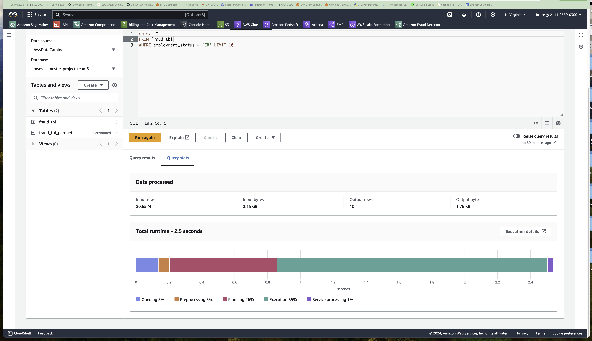
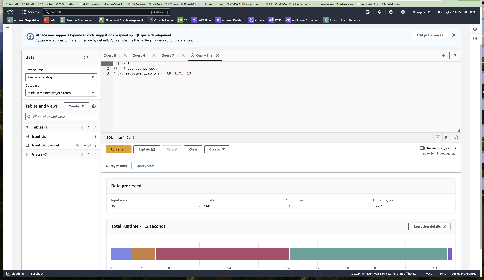
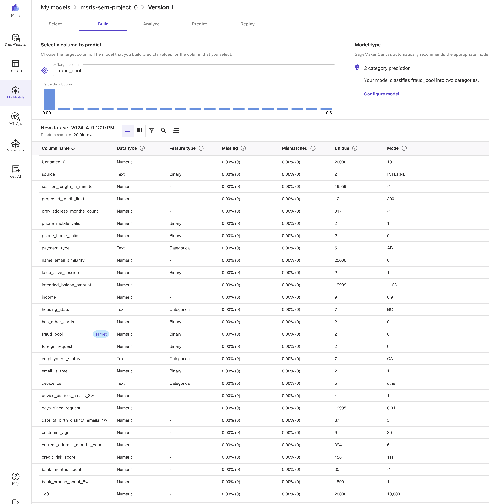
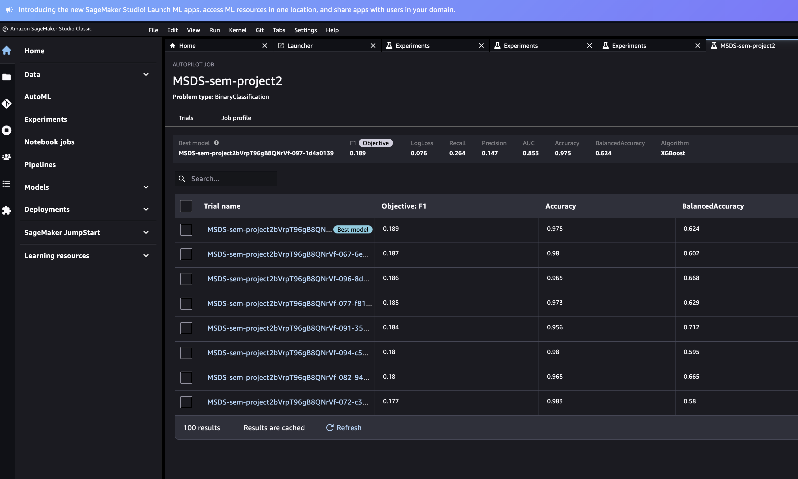
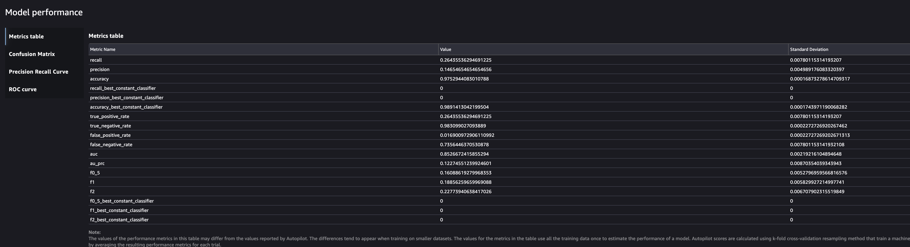
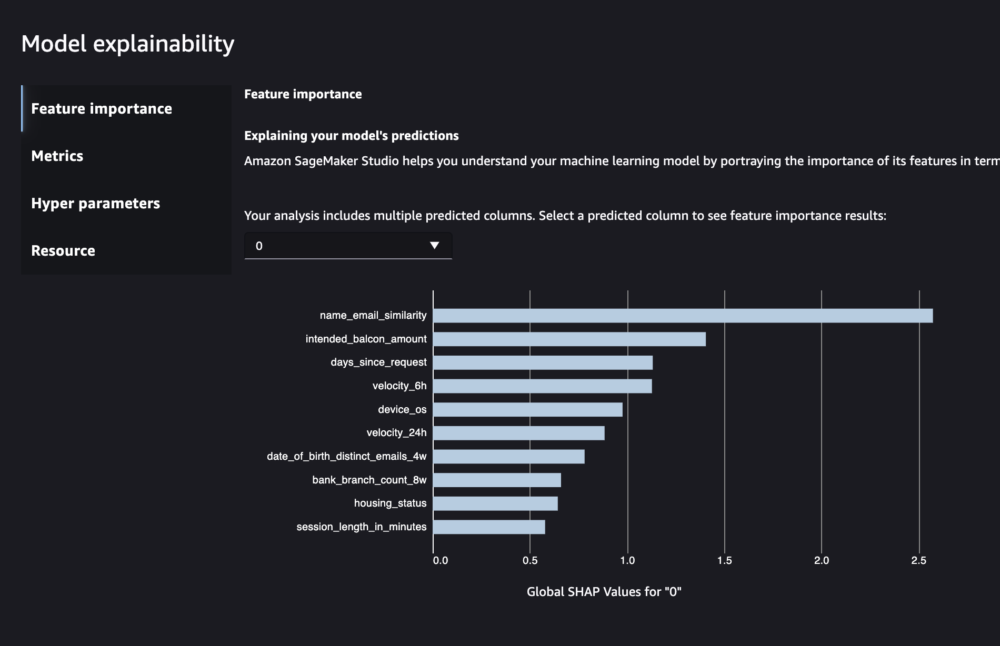
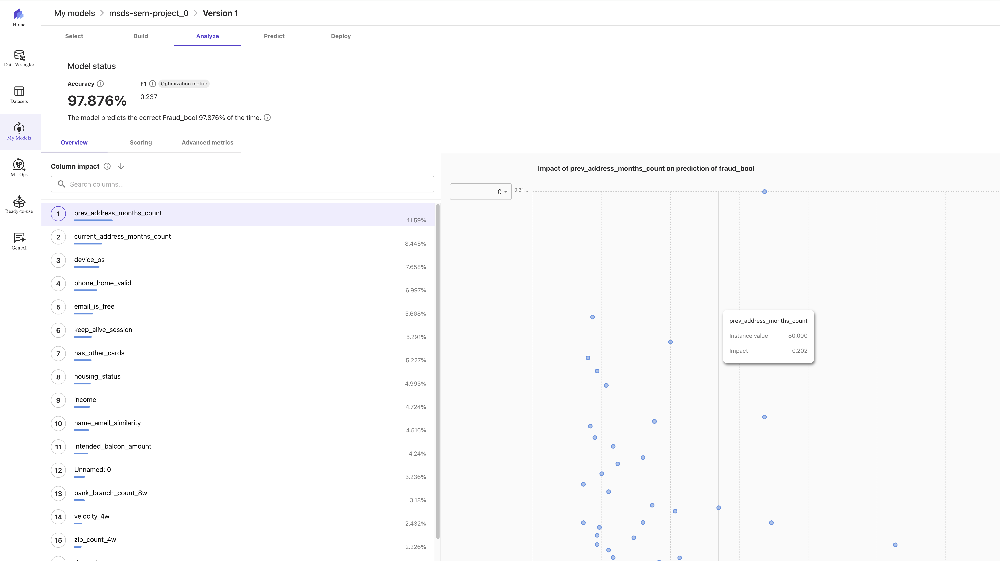
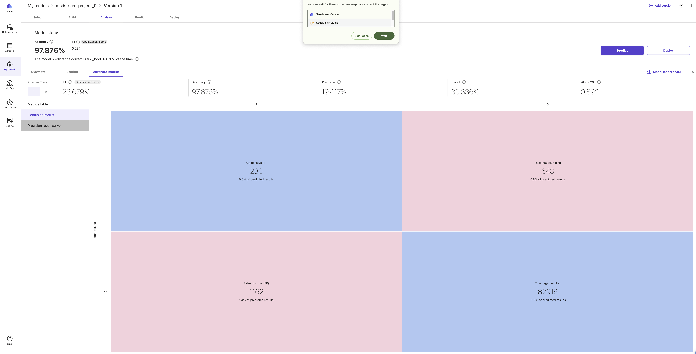

# Identifying Fraudulent Bank Account Applications
By: Katherine Sejas, Michelle Wu, and Bruce McGregor

# Introduction: 

Identifying fraudulent bank account applications, such as ones based on stolen identities or with false information. This adversely impacts the victim’s (whose identity was stolen) ability to then later open bank accounts and obtain credit. Based on the FTC Consumer Sentinel Network Data Book 2023 - there were over 1 million identity theft related reports filed. ​

Our objective is to develop a model that identifes fradulent bank account applications that maximizes the f1 score since both false positives and false negatives are costly. A false positive would deny a person from opening a bank account when there is no fraudulent intention, while a false negative would approve opening a bank account for a person with fraudulent intention, therefore to balance out both of these concerns we are using the F1 score instead of just either recall or precision. 

AWS offers many advanced capabilities that can accelerate model development time compared to traditional model building processes. These capabilities include: 

- Fully managed services such as AWS Fraud Detector  

- AWS Sagemaker “jumpstart” service, which offers pre-built models for several use cases including Fraud Detection 

- Sagemaker AutoML that provides an automated model building process, while simplifying the model training and tuning process 

Automated machine learning and model building services accelerate model building time by removing the undifferentiated heavy lifting of creating infrastructure and by automating data preprocessing, feature selection and model tuning processes. This enables us to spend more time on domain specific problems. 

Our learning objective was to understand the advantages and disadvantages of using AWS AutoML compared with the traditional custom model development process in the context of the bank fraud detection use case. 
For our project we explored the AWS Sagemaker AutoML service to understand how it could be applied to develop a fraud detection model from our data set. We evaluated the results obtained through AutoML and compared them to the results obtained through traditional customized model development processes. Our end goal is to determine to what extent the use of  AutoML provided advantages in terms of model building speed, performance  and cost compared to a traditional approach. We hope to share these insights for future teams when deciding what approach to be taken for model building for a given budget. 

# Data: 
When conducting our research to identify a dataset related to fraud, we came across datasets where the predictor variables were transformed or had the predictor variables with coded field names and/or values due to confidentiality issues. For this project we wanted a dataset that would have identifiable variables that would resemble the types of fields and values you would actually see in a bank account opening application. Consequently, for this project we choose to use the Bank Account Fraud Dataset Suite (https://www.kaggle.com/datasets/sgpjesus/bank-account-fraud-dataset-neurips-2022/data) obtained from Kaggle to create a model that will identify fraudulent bank account opening applications. 
 
The Bank Account Fraud Dataset Suite consists of 6 separate datasets with each stored in a separate CSV file: base, variant 1, variant 2, variant 3, variant 4, and variant 5. All of the data was synthetically generated by a generative model (CTGAN) that was trained on real-world anonymized bank account opening fraud data (https://github.com/feedzai/bank-account-fraud/blob/main/documents/datasheet.pdf). For this project we are utilizing the base dataset, which was sampled to best represent the original dataset. 

The base data consists of one million observations. Each observation in the dataset represents a bank account opening application. The data has 30 predictor variables of which 5 are categorical variables, while the rest are numeric. The data provides various features related to the applicant like their income, employment status, a field indicating the similarity between the email provided and the applicant’s name, credit risk score, housing status, fields indicating the validity of telephone numbers provided, month of when the application was made, the number of minutes the applicant spent on the banking website, and various other fields. 

The table below shows summary statistics for the predictor variables in the data. 

We conducted exploratory data analysis to get familiar with the data, understand the fields and values provided, and evaluate whether there was any preprocessing, data cleaning, or outlier removal needed before we started the modeling process. We applied basic cleaning to the string/character variables so they would all be uppercase and have no leading or trailing blanks. The values for the string/character variables were otherwise harmonized, so no additional cleaning was needed. For 5 of the variables in the data (prev_address_months_count, current_address_months_count, bank_months_count, session_length_in_minutes, and device_distinct_emails) the missing values were coded as -1. The intended_balcon_amount variable had its missing values coded as negative values. Using imputation for the missing data did not seem appropriate due to the nature of the data. 

Based on looking at the correlations between the variables in the data we decided to:  

1. drop date_of_birth_distinct_emails_4w while keeping customer_age (due to correlation between the variables)
2. drop month, velocity_6h, and velocity_4w while keeping velocity_24h (due to correlation between the variables)
3. proposed_credit_limit and credit_risk_score both have high correlations to each other, therefore only one can be used in a given model

There weren’t any extreme outliers we needed to remove from our data. Also there were no duplicate observations in the data as expected. As part of the data pre-processing, we created fields that were standardized for use in some of our model training experiments. 

Our models utilize the “fraud_bool” field as our response variable. It is an indicator variable, which is equal to 1 if the bank account opening application is fraudulent and equal to 0 if it is not fraudulent, thus a legitimate bank account application. The data is imbalanced: only 1.1% of transactions have fraud_bool equal to 1.

# Model Type and Tuning Selection Pre-AWS Experiments: 

For the model training we ran eight different experiments. All our experiments used a 70% training and 30% testing split. The metric we are using to evaluate our models is the F1 score since both false positives and false negatives are costly. A false positive would deny a person from opening a bank account when there is no fraudulent intention, while a false negative would approve opening a bank account for a person with fraudulent intention, therefore to balance out both of these concerns we are using the F1 score. 

The python PyCaret library was used to run experiments 1-3. For experiments 1-3 we ran 15 different model types (Logistic Regression, K Neighbors Classifier, Ridge Classifier, Random Forest Classifier, Extra Tree Classifier, Dummy Classifier, SVM Linear Kernel, ADA Boost Classifier, Extreme Gradient Boosting, Gradient Boosting Classifier, Light Gradient Boosting Machine, Linear Discriminant Analysis, Decision Tree Classifier, Naive Bayes, 
Quadratic Discriminant Analysis) in order to determine what model types performed best so we should focus on those in later experiments. All our models in experiments 1-3 were run on a 100,000 random sample of the data, which was then split as 70% training data and 30% testing data. The raw predictor variable values were used in these experiments, not the standardized values. For experiments 1-3 we specified that predictor variables with inter-correlations higher than 0.6 should be removed from our models run, thus only one of the predictor variables from the ones that have multicollinearity among themselves is kept in the model, specifically the feature with the highest correlation to the response variable is kept in the model while the others are dropped to resolve the multicollinearity issue. 

In experiment 1 PyCaret’s setup options were used to have it automatically select the 6 best predictor variables to utilize based on the LGB Classifier in each of the 15 model types run. 
Experiment 2 was similar to our first experiment except that we used the synthetic minority over-sampling technique (SMOTE) to address the imbalance in the response variable. The results of the models in experiment 2 performed better than our first experiment. Our third experiment was similar to our second experiment except we increased the number of predictor variables in the models to be 10 instead of 6. 

Our table below shows the recall, precision, and f1 score for experiments 1-3. Overall the table shows that a high recall value was achieved, but with low precision and F1 values. 
The Gradient Boosting Classifier model from Experiment 2 had the highest recall value = 0.7497. The Extreme Gradient Boosting from Experiment 3 had the highest precision value = 0.1429. The Light Gradient Boosting Machine from Experiment 3 had the highest F1 value = 0.099. 

Table: Experiment 1-3 Recall, Precision and F1 Scores based on the Fraud_Bool = 1 values not the weighted average across Fraud_Bool values. 

For our fourth and fifth experiment we decided to utilize the Gradient Boosting Classifier Model since it had the highest recall value based on experiments 1-3. For these experiments we used a random sample of 10,000 observations instead of a 100,000 observation sample as used in experiments 1-3 due to computing constraints in google collab and in order to run through various different predictor variable combinations. We decided to limit the predictor variables we tried for the various predictor variable combinations in our models to the ones that appeared to best predict fraud_bool. For our feature selection we looked at box plots and calculated the percentile values and average when fraud_bool = 0 versus when fraud_bool = 1 for each of the predictor variables in the data. Consequently, based on this information we decided to then utilize only 11 of the predictor variables for further model experiments. The 11 predictor variables we choose were: 'income', 'name_email_similarity', 'prev_address_months_count', 'current_address_months_count', 'customer_age', 'intended_balcon_amount', 'zip_count_4w', 'bank_branch_count_8w', 'credit_risk_score', 'bank_months_count', and 'proposed_credit_limit'. We dropped the other predictor variables from consideration due to their similar percentile values across the fraud_bool values. In addition, we decided to drop observations where current_address_months_count or device_distinct_emails_8w had missing values since there were only a few observations impacted by this. 

For experiments 4-8 we switched to using the scikit-learn python library instead of the PyCaret library in order to be able to run our model experiments on a local computer instead of google collab due to the time constraints placed by google collab’s free version. Experiment 4 and 5 used the original raw predictor values, not standardized values and did not utilize SMOTE. Experiment 4 ran Gradient Boosting Classifier Models testing all possible 3 predictor variable combinations based on our par down list of 11 predictor variables. Additionally, experiment 4 tested various hyperparameters, specifically various different learning rates (0.05, 0.1, 0.25, 0.5, 0.75, 1) and number of boosting stages (50, 100, 150, 200) with a max depth of 3. Experiment 5 ran Gradient Boosting Classifier Models testing all possible 6 predictor variables (instead of 3 like in experiment 4) combinations based on our same par down list of 11 predictor variables. Based on the results of experiment 4 we adjusted the hyperparameter values tested in experiment 5 to help optimize the model, specifically we used smaller learning rates (0.05, 0.1), same values for the number of boosting stages (50, 100, 150, 200), and this time also tested a max depth of 4 plus the previous value of 3. 

For experiment 6 we tested a Gradient Boosting Classifier Model with 6 specific predictor variables: 'income', 'name_email_similarity', 'prev_address_months_count', 'current_address_months_count', 'customer_age', 'zip_count_4w' using standardized predictor variables. We choose these specific 6 predictor variables out of the 11 previous features selected due to their better performance relative to the other features based on experiment 4 and 5 results. In addition, unlike prior experiments we used the whole data (1,000,000 observations) to create the 70% training and 30% testing datasets. In addition, this experiment used SMOTE and continued to test various hyperparameters, specifically the learning rate (0.01, 0.05), number of boosting stages (50, 100, 150, 200, 250), and max depth (4, 5, 6). We adjusted the hyperparameter values used based on the results of the fifth experiment, specifically, used smaller learning rates, higher number of boosting stages, and higher values for max depth since the prior models showed more favorable results for hyperparameter values inclined in this direction. 

For experiment 7 we continued to use the whole data to create the training and testing datasets and continued to use the standardized predictor variables. However, the model type we decided to use instead was a Logistic Regression Model with 6 Predictor Variables using elastic net, solver saga, and a balanced class weight. We also cut down the prior list of 11 features down to 9, specifically we decided to exclude 'prev_address_months_count' and 'bank_months_count'. In this experiment we tested all possible 6 predictor variable combinations based on those 9 features selected. This experiment did not use SMOTE. In this experiment we also tested various hyperparameters for the L1 ratio (0, 0.25, 0.5, 0.75, 1) and max iterations (100, 150, 200, 250). The models from this experiment did not converge. 

Experiment 8 continued to use a Logistic Regression Model with 6 Predictor Variables using elastic net, solver saga, and a balanced class weight as in experiment 7. It also continued to test all possible predictor variable combinations using standardized values based on the 9 predictor variables used in experiment 7. This experiment continued to not use SMOTE.  Since the models from experiment 7 did not converge, the max iterations values run in experiment 8 were increased (500, 750, 1000) and 4 different regularization strengths (0.25, 0.5, 0.75, 1) were tried while continuing to try out the same L1 ratio values from experiment 7 (0, 0.25, 0.5, 0.75, 1). This experiment was run on a 100,000 observation random sample. However, despite using higher max iteration values the models in this experiment also did not converge. However, some of these models did perform better in regards to f1 score, precision, and recall relative to prior experiments. 

Experiments 4-8 Summary Table

The model with 'current_address_months_count', 'customer_age', 'intended_balcon_amount', 'zip_count_4w', 'bank_branch_count_8w', and 'credit_risk_score' predictor variables from experiment 8 performed best with using a 0.75 regularization strength, 500 max iterations, and a L1 ratio of 0. Consequently, we then ran this model on the full data (70% training; 30% testing) using SMOTE to create the final top performing model that we saved to utilize in our model inference in AWS. 

# Top Performing Model Metrics Pre-AWS Experiments 

The table below shows the confusion matrix for our top performing model based on the test dataset. Our top performing model correctly classified 203,417 non-fraudulent bank account applications as non-fraudulent, but mislabeled 91,936 non-fraudulent bank account applications as fraudulent. Additionally, it correctly classified 2,182 fraudulent bank account applications as fraudulent, but mislabeled 1,082 fraudulent bank account applications as non-fraudulent. 

The table below summarizes the precision, recall, and f1 score for experiments 4-8 plus the top performing model from our model tuning phase. We chose the model with the second highest f1 score from experiment 8 since it better identified fraudulent bank account applications than the model from experiment 8 with the highest f1 score as shown through the recall values when response equaled 1. 

The table below shows the classification report for our top performing model. The weighted average precision is 98%, recall is 69%, and f1-score is 81%. 

# Model Inference using Top Performing Model from Pre-AWS Experiments

All of the different models were trained on google colab or a local machine, and once a top performing model was identified, we were able to create an Amazon SageMaker model with an endpoint so that it could be invoked for inference. To do so, we followed Amazon’s steps for deploying a model for real-time inference. Real-time inference was chosen because it can be used for a persistent and fully managed endpoint that can handle sustained traffic.

To be able to create an endpoint, the model artifacts needed to first be uploaded to an Amazon S3 bucket. The model artifacts included the saved model file and an inference script. The inference script was written with four required functions, model_fn, input_fn, predict_fn, and output_fn. This entire directory is saved in a tar.gz format and uploaded to an S3 bucket. 

Afterwards, we created a deployable model in SageMaker by providing the model artifacts with specifications for what the container and framework would be. We created and deployed the model using the Python SDK with boto3 components to be able to connect it to the AWS account. The framework we used was Scikit-Learn since the model was trained using a Scikit-Learn logistic regression model. After the model was created, it could then also be deployed using SageMaker Studio to create an endpoint, where we defined the different configurations. The configurations that were decided was to use a one instance of ml.c5.large with a maximum of 8. Additionally, we are using 1 CPU core with a minimum of 128 CPU memory. Once the model endpoint is deployed, it can then be evoked to test real-time inference.

To invoke the endpoint, we used the Python SDK with boto3 components to connect to the endpoint and send an inference request in order to evaluate the model. The script defined the endpoint name and loaded in a sample dataset for inference. The sample dataset is only a small portion of the full test portion of the dataset in order to keep file sizes small for AWS costs.  A confusion matrix can be seen below for what the results looked like. The true positive rate for detecting fraud is 100% and the true negative rate for correctly detecting something isn't fraud is 83%. The recall is 100%, the  precision is 85.5%, and the F-1 score is 91%.

The necessary scripts and files for deploying a model to SageMaker Studio can be found in the directory `deployment`. 

# AWS AutoML Experiment Design: 

To reduce training costs, the original data set was subsetted using the SciKit learn library’s train_test_split function to reduce the data set to a smaller subset of records. We used a Python script to create two smaller subsets from the Base.csv dataset. 

The python script used to sample the original data set can be found at: 

The train and test datasets created are:

- Train.csv - 425,000 Rows. - Used as the training dataset. 

- Test.csv - 75,000 Rows – Used as the test dataset. 

These two files were loaded into AWS S3 at the following location: 

- https://us-east-1.console.aws.amazon.com/s3/object/msds-sem-project1022?region=us-east-1&bucketType=general&prefix=test.csv 

- https://us-east-1.console.aws.amazon.com/s3/object/msds-sem-project1022?region=us-east-1&bucketType=general&prefix=train.csv 

Through the AWS console within the Sagemaker service, AutoML was used to automate the model building process.  AutoML simplified the process of splitting the dataset, so all that was required was pointing the AutoML process to a data set.  The Train.CSV was used for the AutoML process.  AutoML handled the preprocessing and split the Train.csv into a test and training dataset internally.   

# Beyond the Original Specification 

AWS services used for analysis and exploration beyond the original specification included the following: 

- AWS Athena - We used AWS Athena to perform some initial interactive queries on the source data file Base.csv.  We loaded the Base.csv file into an S3 bucket.  We then issued a few AWS CLI commands to partition the data into the Parquet format along the dimension of the employment_status field.  This was intended to understand how the AWS Athena service worked and its ability to enable us to query data directly from S3 thus not requiring us to load data into a Red Shift data warehouse.

We tested the query performance in Athena using the raw table from S3 as well as the data partioned by the employment_status column using the parquet format.  Using the raw table we observed a total runtime performance of 2.5 seconds for a sample query.
  

After partioning the data by employment_status_column using the parquet, we observed total runtime of 1.2 seconds, over a 100% improvement in query performance.  
  

  Other services that we experimented with using for our project included:

- AWS Lake Formation: In addition, we experimented with the AWS Lakehouse Formation.  We created an AWS Lakehouse and created a database for the semester project that housed a fraud_tbl and fraud_tbl_parquet, providing centralized access to our data sources. 

- AWS Glue – We indirectly used the AWS Glue service when using the Athena service as we had to define the schema on demand for the fraud_tbl  before we were able to query the data. 

# AWS Sagemaker AutoML Experiment Results:  

The following shows the results from a data analysis results obtained from Sagemaker AutoML.

# 
Results 

We will first review the results from the AutoML process run under the Studio Classic, and then share the results produced under the Sagemaker Canvas service. 

## Sagemaker Studio Classic Results

Auto-pilot ML ran 100+ training jobs to optimize the selected model. The best model selected by AutoML produced a model with an F1 score of 0.189 and an accuracy of 0.975.
 
## Model Building Results
The following shows the results from 100 different model builds performed by Sagemaker AutoML

## Model Performance

## Feature Importance and Model Explainability

## Confusion Matrix

# Sagemaker Canvas

Sagemaker Canvas is a new user interface and experience for automated model building. The results using the Canvas interface are visually more appealing and more user friendly. This is aimed at making model building very fast for users with less experience, but who need to have a model built quickly. 

## Model Leaderboard
The model leaderboard shows the top performing models 

## Model Results
The following displays the overall model accuracy, F1 score and impact each data element contributed to the score.

## Confusion Matrix
The following shows the detailed metrics within the confusion matrix.

# Testing

We ran a manual batch test within Canvas using our test data set of 75,000 rows.  This was performed from within the Canvas interface. It demonstrated that the model was working and ready for deployment.  We did not deploy the model; however, this can be done from within the Canvas console.

# Costs
## AutoML
When using the AutoML for model training with the default settings, the major cost drivers were training and processing on large instances, specifically the ml.m5.12x and the ml.rd.16x instances.

The costs for training the model using the AutoML were as follows:

- $2.765 per Training ml.m5.12xlarge hour  for 25.094 hours , $69.38
- $4.838 per Processing ml.r5.16xlarge hour for 8.046 hrs , $38.93

The total costs for running our model training in the AutoML environment were $109.88.

## AWS Model Inference
The table below summarizes estimated AWS costs for deploying a model into SageMaker Studio to run real-time inference. The most expensive is using the studio notebook. The total for running inference is around $50. Note that these costs are based off a subset of the training dataset in order to keep costs low when using the class instance of AWS.

# Conclusions

#### Results Comparison 

### Inference​

Predictor Variables: 'current_address_months_count', 'customer_age', 'intended_balcon_amount'  'zip_count_4w', 'bank_branch_count_8w', 'credit_risk_score'​

Recall: 1​

Precision: 0.855​

F-1 Score: 0.91​

### AWS Studio Classic​

Predictor Variables: name_email_similarity, intended_balcon_amount, days_since_request, velocity_6h, device_os, velocity_24​

Recall: 0.62​

Precision: 0.147​

F-1 Score: 0.189​

### AWS Sagemaker Canvas ​

Predictor Variables: Prev_address_months_count, current_address_months_count, device_os, phone_home_valid, email_is_free, keep_alive_session, has_other_cards, housing_status, income​

Recall: 0.303​

Precision: 0.194​

F-1 Score: 0.237

#### Overall
- Model results were superior using custom model development compared to AutoML​.
- The use of 6 predictor variables in a model yielded the best results.
- Simple process to integrate custom model into AWS SageMaker Studio Inference Pipeline.
- The results using the two different AutoML processes produced different model results.
- The Sagemaker studio classic provided all the model results and reports back to the S3 bucket, providing full model building transparency.

#### Advantages of using AWS vs Traditional Model Building Process
- Simple, intuitive interface that requires no coding to get a model up a running quickly
- AWS selects the best algorithm based on the use case (e.g., 2 category prediction)
- Fully automates process of splitting dataset, model building, and model tuning
- Runs many different combinations of hyperparameters and provides you with a top performing model
- Easy to run manual and batch predictions 
- Simple model deployment

#### Disadvantages
- Costly using AWS environment  to run everything inside AWS
- Less control over the algorithm choice and hyperparameter choices

# Project Environment Setup: 

import numpy as np

import pandas as pd

import os

import sys

import matplotlib.pyplot as plt

import seaborn as sns

import plotly.express as pexp

from sklearn.linear_model import GradientBoostingClassifier

from sklearn.linear_model import LogisticRegression

from sklearn.model_selection import train_test_split

from sklearn.metrics import classification_report, confusion_matrix, roc_curve, auc

import itertools

from imblearn.over_sampling import SMOTE

from pycaret.classification import *

from imblearn.over_sampling import SMOTE

import pickle

try:
    import pycaret
except:
    !pip install pycaret

