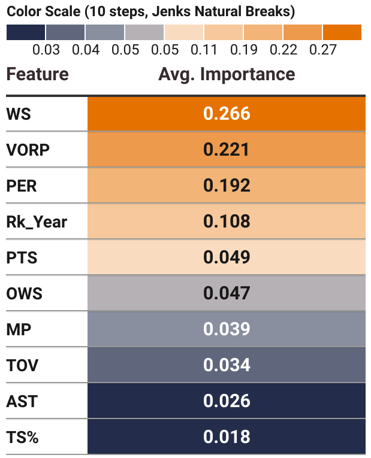
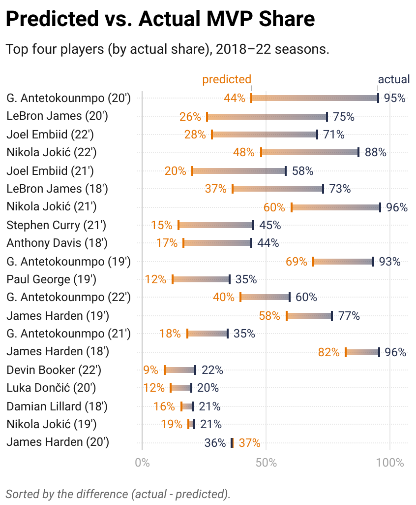

![Static Badge](https://img.shields.io/badge/Repo_Status%3A-Work_in_Progress-blue?style=flat&logo=data%3Aimage%2Fpng%3Bbase64%2CiVBORw0KGgoAAAANSUhEUgAAAC0AAAAiCAMAAAD8kqB9AAAClFBMVEUAAAD%2F%2F%2F%2FBYzTCysr2WxvyQRLnSibjUy3VZSLbQyvSjHHIjEX5%2F%2F%2F5%2B%2FvIz9D8%2F%2F%2F4WhryWRz3QBHxUR7ySh%2FxbBjsTiHwbxnnTCXVQiz96eTg4N%2Fd3dzL0tH0XDPFzc32SRv0UB%2F3WRr4XRn1SR32VBv1Uhz0TB71URz0QBDySh3%2FYAP4ZxT1YxnwXRz0ZxnvTh7vVR7yPhDxQhfrTB%2FcVCLfRSzUUCfdPCbLciPQOjLu8fHc5OXn5eT85uHj4uHY19bKt6%2F3WBv2Uhv0WS%2F1TSDyWjT0Sx33XBr3Vhv0Vxz3XRr3Xhr1Uhv0Ux30SRv0Whv3Yhn2Xhr0UhzzPg%2F2RBb0Tx7zPg%2FzPg7zUR33YxjyTh%2F7XgL6WQDxTh%2FwVB%2F3Pw%2FzPA3wTh7zYRv1aBntTCDxXhzrTx%2FwSh7oYCDxaxjuTiDmSyHsWR7rPxnoQiXnchrmehr%2B9%2FTs7%2FD%2B7unW2djQ19jm2dbHxcLKuLD3v6%2FJrKL1SRvvelv25ePBxML7aRfg7%2FbS5ezY7PDA1t32VBv2UBz0SR70QxT0QxT0QxT2VRv1VRz3Yhn1Sx34VRvyTB%2F1Sh71Rhj2Uhz2TBj3YRn3Yxn1RBb5ZBfxTB%2F2ZBn7Zgz4Zhj4QhPuWB30ZBrySR3yXhzvSyDvWRv3PxDvTR%2F0WRzyYhvyPQ32aRryahrvViDuYhnxQRPzbRrsRh%2FYXSPuchnrcxjRp5vqbEr5v6%2F0cU3wWDD849vQqqD3pI32n4b2moDfhmznlmTocVD0XjX5Vhrl5ubKtKvirZ%2FPpprTpZbWnI%2F8q3z2lnv4lHn5pXXwn27fhGrfgmjlkF%2F5klzmclPjcFD1bUn0Z0Ptd0H3bDb0VCr0WyT4WRn7YRf4PQvBMCeZAAAAs3RSTlMA%2FQj72VQnHBIPBgX%2B%2Fv78%2BKqajGI0LyolBv7%2B%2Fv79%2FPX09PTu287Cv7%2B1oqCTi394c1pONCIYFRINCv7%2B%2Fv7%2B%2Fv79%2Ffv39fHw7evp4uHS0M%2FMysXFwbq4s7Cwq6SimpGQgX59eHJoYFlRUElHRD8sGRX%2B%2Fv7%2B%2Fv7%2B%2Fv7%2B%2Fv38%2FPv6%2Bvn57u3p4%2BLd19bV0tLNzcrIwsC5trSnp6eioJ%2Bem5uVlZWRkIiDbmlcS0tEOTQjHZlkpy4AAAI7SURBVDjLYqAPyBHU0Y6NjZlvCuZxLp%2BtrR2jI5iOS7nWjX2nT1xQ5ARzuKdc3Xf%2BzDV%2Fdlyq2dt3NvHbqUhAzJ50vKWxzi0Pt1sSttRLM25bAWYbbXd0YDwVgcflEirH%2BHi2dpoBmVyhe%2BWtd7isBTLxGM4MNDyRQZKBdXtlKf%2FJCLzBwua%2BGWh4BzsDE8RoY%2FyhuGQLsz3%2F5USg0Y4yjHvCufCrZlPYLMuztYt9%2Bjk%2BXjs5Y0JRJAQ0nHFbiNthaaDRQD4RhlfdPsvHKyXHSjj%2BhfYz2xbVVtsw7tbkIqxaAmg4b3kFwmjChh%2BSgRhNGIi57iyTKS45YIRDHiAONMMvyjvw70Iz2hzOMs3kQDX8qI3UARRXc2duQJLXW4MsN%2FdS864QJiQBUb1cZHnTeQvFETwTxSNXkFxdoCdoguZ2wwDdjXDOguvqcKMLkwOEOTG8mh%2FpoysOM7xGBMrapM8SnIM1aDL8PGat4waxJFPZIe7V9fZNlcQRklYiagKB%2BqLcEJ74yqlKqklmeGLGyjjSU3laimiB%2BCrAoryVwkTMgYGHUzHIUjMDr1sNPso3BeLZcKpjMmfisEwTzErRiQpUVurXmNgm0Dtjjn7WsuRCDqAMWvj1%2BAWxsHgcdPJUnRwnst6CwVIsQ1ij28vpoAALS5Ca6mIU1aujVaINklp9s%2FMtkEQ52fKCneMN4tzDDNGcsmiCsIZzGoYLcxXVhNW1mNCFLZb6q2MrILO1%2BmZKYPMorlBlIBcAACpxj1lvNSqgAAAAAElFTkSuQmCC&labelColor=%23232D4B&color=%23E57200)

<h1 align="center">
    
</h1>

# Sarah Elmasry, Ran Gao, Wyatt Scott, and Rish Sharma

<h1 style="font-size: 22px;">Report</h1>

<h3 style="font-size: 16px;">Introduction</h3>

Data Scientists and analysts have developed several metrics for determining a player's value to their team's success. Prominent examples include Value Over Replacement Player (VORP), Box Plus/Minus (BPM), and FiveThirtyEight's Robust Algorithm (using) Player Tracking (and) On/Off Ratings (RAPTOR)​. We aim to develop a multivariate index that weighs these parameters based on how well they predict MVP rankings, then test it on unseen data for the most recent five seasons to see if our "MVP index" correctly predicts the MVP rankings.​ We will experiment with the index formula and compare it to other methods developed by reputable analyst sources.

<h3 style="font-size: 16px;">Data</h3>

We obtained the dataset from Kaggle, but the data was originally scraped from Basketball-Reference via automated HTML parsing. The dataset contains statistics for National Basketball Association (NBA) players relevant to determining the Most Valuable Player (MVP) in a season and has 7,329 entries with 53 columns. The dataset is significant in its breadth and depth of coverage.

The dataset is stored in a comma-separated Excel sheet, `mvp_data.csv`, which we load into `DataCleaning_EDA.ipynb` and perform some cleaning and aggregation steps, including:

* Fill missing values for the Rank, mvp_share, and Trp Dbl (Triple Double) columns
* Normalize the Trp Dbl column by dividing it by G (the total number of games played in a given season)
* Convert G (Games) and Season columns to integer data type
* Filter the entire data frame (`df`) to include only players that meet the 40-game requirement necessary to be considered for the MVP award
* Create the Rk_Conf (Conference Ranking) column – calculate conference rankings for each season based on W (the number of wins), then re-rank the conference rankings within each season and conference group.
* Save the edited data frame thus far to `mvp_data_edit.csv` (we use this in `Test.ipynb` to merge predicted values with actual and compare results)
* Drop the Conference and W (Wins) columns
* Create a separate data frame (`df_last`) with the data for the most recent five seasons (2018–22), which we use to test our final model and index in `Test.ipynb`
* Create last_names and last_seasons
* Check for missing values: We found many missing values for seasons before 1980; for example, 3P (Three-pointers) were not introduced in the NBA until 1979–80, and there are a lot of missing values before then, so we drop any season before 1980.
* Save `df` and `df_last` to comma-separated Excel files

We discuss some additional preprocessing steps in the Experimental Design section below, as these steps relate to the project's feature selection and modeling phases.

The values we seek to predict are in the `mvp_share` column, which represents the result of the MVP voting for each season.

<h3 style="font-size: 16px;">Experimental Design</h3>

<h4 style="font-size: 14px;">Hardware Details</h4>

We use Rivanna – the University of Virginia’s High-Performance Computing (HPC) system – with the following hardware details:

* **System**: Linux
* **Node Name**: udc-an34-1
* **Release**: 4.18.0-425.10.1.el8_7.x86_64
* **Version**: #1 SMP Thu Jan 12 16:32:13 UTC 2023
* **Machine**: x86_64
* **CPU Cores**: 28
* **RAM**: 36GB
* **CPU Vendor**: AuthenticAMD
* **CPU Model**: AMD EPYC 7742 64-Core Processor

<h4 style="font-size: 14px;">Feature Selection Process</h4>

In `FeatureSelection.ipynb`, we load in the main data frame (`df`) that we created and saved in `DataCleaning_EDA.ipynb`.

We perform robust feature selection to reduce model and index complexity. The main code we use for feature selection can be found in `preptrain.py`. This Python module file includes a function, `preprocess_and_train`, which we employ in `FeatureSelection.ipynb`. We wrote the function to perform the following:

* Impute missing values with the median value for numeric features, scale the features using standardization (subtracting the mean and dividing by the standard deviation) and apply one-hot encoding for categorical features.

* Apply the preprocessing separately to the training and testing datasets and extract the feature names, removing any prefixes.

* Train and test eight different models on the preprocessed data and extract the feature importance scores of the top ten predictors. The models are:

  - Random Forest (RF)
  - Decision Tree (DTree)
  - Principal Component Analysis (PCA)
  - Gradient Boosting (GB)
  - Support Vector (SVR)
  - Extra Trees (XTrees)
  - AdaBoost (Ada)
  - Extreme Gradient Boosting (XGB)

For hyperparameter tuning, we define a reasonably extensive parameter grid for each method and use Bayesian optimization with five-fold cross-validation to sample parameter settings from the specified distributions.

In `FeatureSelection.ipynb`, we run the `preprocess_and_train function` from `preptrain.py` and use the `print_dict_imps` function from `print_imps.py` to print tables of the feature importances for each method, which we store in a Python dictionary via the `preprocess_and_train function`. We then use the `avg_imp` function from `print_imps.py` to display the average feature importance across the eight methods. 

We then use the `avg_imp` function from `print_imps.py` to display the average feature importance across the eight methods. The results for the top 10 features included several features related to points (scoring) that are highly correlated, including FT (free throws), 2P (two-pointers), FG (field goals), FGA (field goal attempts), FTA (free throw attempts) and PTS (points).

The results for the top 10 features include several highly correlated features related to scoring, including FT (free throws), 2P (two-pointers), FG (field goals), FGA (field goal attempts), FTA (free throw attempts), and PTS (points).

We chose to drop all of these except PTS because the latter effectively captures the others. The resulting top ten features are:

- OWS = Offensive Win Shares (see <a href="https://www.basketball-reference.com/about/ws.html">NBA Win Shares</a> for more information on how this is calculated)
- MP = Minutes Played
- PTS = Points
- WS = Win Shares (see <a href="https://www.basketball-reference.com/about/ws.html">NBA Win Shares</a> for information about how this feature is calculated)
- VORP = Value Over Replacement Player
- PER = Player Efficiency Rating (see <a href="https://www.basketball-reference.com/about/per.html">Calculating PER</a> for the formula)
- TOV = Turnovers
- AST = Assists
- TS% = True Shooting Percentage
- Rk_Year = Team league ranking

There are still some highly correlated features, but we proceed with these 10 and save them into a comma-separated Excel file (`df_separated.csv`) to use for modeling.

<h4 style="font-size: 14px;">Modeling</h4>

In `Models.ipynb`, we use `df_selected.csv` to train and test only the ensemble and tree-based methods, as these are best suited for our next task — finding the best model we can and using the feature importance scores to inform our index design.

The image below displays the average feature importance score for each feature. 

As the table shows, on average, Win Shares (WS) and Value Over Replacement Play (VORP) are the most important features. 

The table below highlights the best-performing model (the ExtraTrees regressor), which barely outperforms the Extreme GradientBoosting Regressor (XGBoost). We save the best ExtraTrees model from `Models.ipynb` and import it into `Test.ipynb`, where we test it against the 2018–22 seasons.

<h4 style="font-size: 14px;">Testing</h4>

In `Test.ipynb`, we load in the selected features as `df_selected`, the training dataset as `df`, the testing dataset containing the data for the 2018–22 seasons as `df_last`, and the best model as `XTrees`. We filter `df` and `df_last` to include only the predictors in `df_selected`. 

We then perform an 80-20 train/test split of `df` and train and test `XTrees`. Next, we use `XTrees` to predict the mvp_share for the 2018–22 seasons and compare the predicted values to the actual values.

The image below displays the top four (by actual MVP share) players for the 2018–22 seasons and compares the predictions to the actual values. 

TO BE CONTINUED AFTER TESTING ...

<h3 style="font-size: 16px;">Results</h3>

TBD...

<h3 style="font-size: 16px;">Testing</h3>

TBD ...

<h3 style="font-size: 16px;">Conclusions</h3>

TBD ...

<h1 style="font-size: 16px;">Repo Manifest</h1>

 Jupyter Notebooks

  
- ### [FeatureSelection.ipynb](https://github.com/WD-Scott/DS5110_Project/blob/main/Jupyter%20Notebooks/FeatureSelection.ipynb):

  Feature Selection notebook where we use the `preprocess_and_train` function from `preptrain.py` and ensemble the methods to generate the best 10 features.
  
- ### [DataCleaning_EDA.ipynb](https://github.com/UVA-MLSys/Big-Data-Systems/blob/main/Team%207/Jupyter%20Notebooks/DataCleaning_EDA.ipynb):
  
  Exploratory notebook where the data is cleaned; includes some basic EDA.

- ### [Models.ipynb](https://github.com/WD-Scott/DS5110_Project/blob/main/Jupyter%20Notebooks/Models.ipynb):

  Modeling notebook where we use the selected features (from `df_selected.csv`) to train and evaluate a range of models and extract their feature importance. These results will inform how we weight features in the index.

- ### [Test.ipynb](https://github.com/WD-Scott/DS5110_Project/blob/main/Jupyter%20Notebooks/Test.ipynb):

  This notebook contains the code where we test our best model (from `Models.ipynb`) against the last five seasons. We include some visualizations showing the model prediction versus the actual values.

 

 Data Files

  
- ### [df_clean.csv](https://github.com/WD-Scott/DS5110_Project/blob/main/Data%20Files/df_clean.csv):
  
  Main .csv file used for training and validation.

- ### [df_last.csv](https://github.com/WD-Scott/DS5110_Project/blob/main/Data%20Files/df_last.csv):
  
  Testing .csv file for examining model performance on last 5 seasons (2018-22).

- ### [df_selected.csv](https://github.com/WD-Scott/DS5110_Project/blob/main/Data%20Files/df_selected.csv):

  Selected features .csv containing the subset of predictor variables.

- ### [mvp_data.csv](https://github.com/WD-Scott/DS5110_Project/blob/main/Data%20Files/mvp_data.csv):
  Initial NBA mvp data set. Reduced in `DataCleaning_EDA.ipynb` to only include essential rows and columns of study.

 

 Python Module Files (helper functions, classes)

  
- ### [pltcorrheatmap.py](https://github.com/WD-Scott/DS5110_Project/blob/main/Python%20Modules/pltcorrheatmap.py):
  
  Custom function to generate correlation heat maps to help determine multicollnearity as we examine feature importance.

- ### [print_imps.py](https://github.com/WD-Scott/DS5110_Project/blob/main/Python%20Modules/print_imps.py):

  Custom function to print model feature importance scores for the selected features.

- ### [preptrain.py](https://github.com/WD-Scott/DS5110_Project/blob/main/Python%20Modules/preptrain.py):
  
  Custom function/pipeline for preprocessing and feature selection.
  

