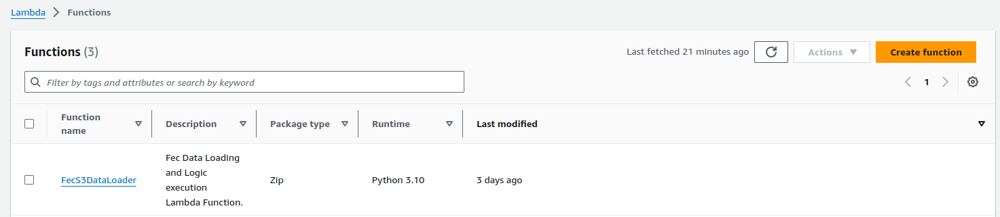
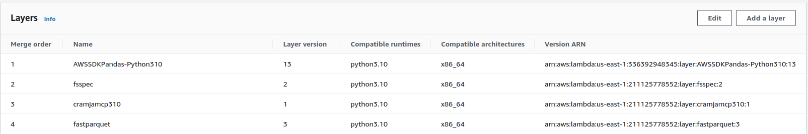
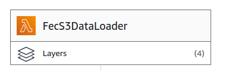
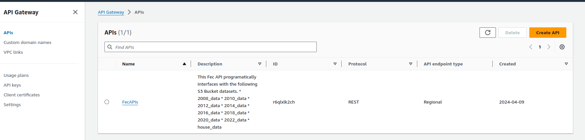

## Reproducibility

This document outlines the step to reproduce the FEC Data Visualization Project.


Overview of the architecture:

1. **Data Storage on S3**:
   - The cleaned data is stored in Parquet format on an S3 bucket named "Team-8".
   - Parquet files offer efficient storage and retrieval of structured data, making them suitable for large datasets.

2. **Lambda Function for Data Processing**:
   - A Lambda function written in Python is deployed to AWS Lambda.
   - This Lambda function is triggered when an API request is made to retrieve data.
   - Upon invocation, the Lambda function fetches the Parquet files from the S3 bucket.
   - It then converts the Parquet files into Pandas DataFrame objects for further processing.
   - The Lambda function ensures efficient and scalable data processing without the need for managing servers.

3. **API Gateway for Exposing Endpoints**:
   - An API Gateway is configured to expose endpoints for accessing the data.
   - The API Gateway routes incoming HTTP requests to the appropriate Lambda function.
   - Endpoints are defined to handle different types of requests, such as fetching specific datasets or performing data transformations.
   - The API Gateway provides a secure and scalable interface for interacting with the data processing Lambda function.

4. **Client Access**:
   - We have built a web application that can interact with the API Gateway endpoints to access the processed data.
   - They can make HTTPS requests to the exposed endpoints to retrieve the desired transformed result from the corresponding dataset.


### Steps to reproduce the project. 

#### 1. Sign Up / Sign In to AWS 


#### 2. Organize and upload the datasets to your S3 Bucket

* You first need to download the datasets from the following [Google Drive](https://drive.google.com/drive/folders/1aL_7WEN18ZsGsT_54K-zEfnBUvBHuBgm?usp=sharing).
* You should then organize your dataset parquet files in S3 the following way 
  

```
team-8-project-data/
├── fec-data/
│   ├── 2008_data
│   │   ├── 2008_prepared_10_15_filtered.parquet
│   ├── 2010_data
│   │   ├── 2010_prepared_10_15_filtered.parquet
│   ├── 2012_data
│   │   ├── 2012_prepared_10_15_filtered.parquet
│   ├── 2014_data
│   │   ├── 2014_prepared_10_15_filtered.parquet
│   ├── 2016
│   │   ├── 2016_prepared_10_15_filtered.parquet
│   ├── 2018_data
│   │   ├── 2018_prepared_10_15_filtered.parquet
│   ├── 2020_data
│   │   ├── 2020_a_prepared_10_15_filtered.parquet
│   │   ├── 2020_b_prepared_10_15_filtered.parquet
│   │   ├── 2020_c_prepared_10_15_filtered.parquet
│   ├── 2022_data
│   │   ├── 2022_a_prepared_10_15_filtered.parquet
│   │   ├── 2022_b_prepared_10_15_filtered.parquet
│   ├── house_data
│   │   ├── 1976_2022_house_filtered_third_party.parquet

```

#### 3. Create a Lambda function 
* Search for Lambda from the global AWS search console and click on the create function button. 
  

* Add Custom Layers to the Lambda function. 
    * We need the **manylinux** version of the listed packages:- 
      * [fastparquet](https://pypi.org/project/fastparquet/#files)
      * [fsspec](https://pypi.org/project/fsspec/#files)
      * [cramjam](https://pypi.org/project/cramjam/#files)
      * **AWSSDKPandas-Python3xx** from the default lambda layer options.

     you have to download this from the pypi. Choose the Python version as per your need and Architecture to install. eg: `CPython 3.10` and `_x86_64` is what the project originally used. Make sure all the packages are cross-compatible. 

* Add the Layers to the Lambda configuration.




#### 4. Increase the Timeout to 5 minutes and Maximum Memory Size for Lambda configuration


#### 5. Pull the code into the Lambda function coding space. You can do a simple copy and paste from the following 
[Team 8/fec_dataloader_lambda_function.py](https://github.com/UVA-MLSys/Big-Data-Systems/blob/main/Team%208/fec_dataloader_lambda_function.py)

If the setup of the dataset parquet files in the S3 Bucket follows the above give structure the code should work out of the box when you test it. Here are a couple of sample test events to use.

```
{
  "queryStringParameters": {
    "view": "HOUSE",
    "party": "LIBERAL",
    "year": "1976"
  }
}
```
 

```
{
  "queryStringParameters": {
    "view": "FUNDING",
    "funding_year": "2008",
    "min": "100",
    "max": "1000"
  }
}

```

```
{
  "queryStringParameters": {
    "view": "CHARTS",
    "party": "LIBERTARIAN"
  }
}
```


#### 6. Create the API Gateway 
* Search for API Gateway and click on Create API.


* Select the REST API *Build*
* Link to the Lambda function using the Resource Identifier or the name of the Lambda function. It should auto-complete for you as soon as you start typing.

#### 7. Connect to the frontend  :clap::tada:

* Follow the [README.md](https://github.com/brooksideas/electoral-visualization/blob/main/README.md).