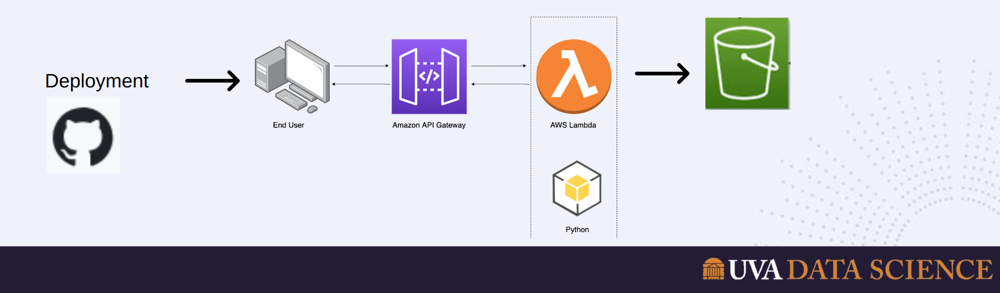

# BigDataSys-Project8

# Data Visualization Project: Analyzing Fusion Voting Impact on Third Parties

## Project Description
This project aims to explore the impact of fusion voting on third-party viability in American politics. The two-party system has long dominated American politics, but there's growing interest in fostering the viability of third parties. Fusion voting, a practice where a third party cross-nominates a candidate from one of the major parties, offers a potential avenue for third-party relevance without risking election spoilers. This project focuses on comparing the longevity, cost, and success of third parties in states where fusion voting is legal versus those where it is not.

## Key Questions
- **Do the number of third-party candidates differ (average per state) over time between fusion and non-fusion states from 2008 to 2022?**
- **Do the lifespan of third parties differ between fusion and non-fusion states?**
- **Do third parties win more elections, year by year, in fusion states compared to non-fusion states?**
- **Do fusion candidates attract more small donor contributions (<$2,000), serving as a proxy for wider public support?**

## Data Sources
1. **Filed Candidate Data:** Federal Election Commission (FEC) Data for U.S. House elections from 1976 to 2022.
2. **Financial Data:** FEC Data detailing money spent and individual contributions to candidates for U.S. House elections from 1976 to 2022.
3. **Election Outcome Data:** Massachusetts Institute of Technology (MIT) Data covering election outcomes and total votes for U.S. House elections from 2008 to 2022.

## AWS Process
Our team has performed data wrangling, data storage on S3 and retrieval using a Lambda function written in python to produce custom visualizations and serve it to our client side web application using the AWS API Gateway. Our end goal deliverable is three types of visualizations – time-series visualization, state-by-state visualization, Fusion party Voting comparison visualization.

## Repository Contents
- **Data:** This folder contains the raw data obtained from FEC and MIT sources.
- **Scripts:** Scripts used for data cleaning, preprocessing, analysis, and visualization.
- **Web application:** A repo containing the frontend development can be found in the following **[Electoral Visualization Repository](https://github.com/brooksideas/electoral-visualization)** and as a subdirectory in this  [location](Frontend/electoral-visualization).
- **Visualizations:** Output visualizations generated from the analysis.
- **README.md:** This file providing an overview of the project.

## Usage
To replicate or extend the analysis:
1. Clone the repository to your local machine.
2. Please follow the `Reproducibility.md`. 
3. Explore the visualizations generated to gain insights into the impact of fusion voting on third-party dynamics in American politics.

## Contributors
- Assefa, Brook
- Koizumi, Hannah
- Ohashi, Naomi

## License
This project is licensed under the MIT License - see the LICENSE.md file for details.
