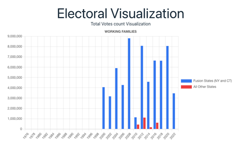
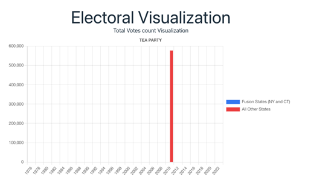

# DS5110 - Team 8
## Team Members: Assefa, Brook Tarekegn, Koizumi, Hannah, Ohashi, Naomi

## Abstract
The purpose of this paper is to use the power of Amazon Web Services (AWS) to process and visualize data on third political parties in the United States in the past 30 years. There has been a natural experiment playing out over the past 100 years because fusion voting is legal in New York and Connecticut but not legal in any other state. This allows us to compare the impact of fusion voting on third parties using data from the Federal Elections Commission (FEC) tracking political candidates and donations and the outcome of US Congressional House elections. We used Dataiku to clean and process the data, created the visualizations through AWS, and published our results on an interactive webpage. Through this process, we were able to process the data and distill the most important information in an accessible product. Ultimately, we were able to identify larger trends, with contextual knowledge of the system, about third parties in American politics and created a great starting point for this research for people in the electoral reform to utilize. 

## Introduction
The American two-party political system means that third parties are either irrelevant or act as spoilers except when fusion voting is present. Fusion voting allows a third party to cross-nominate one of the two major party candidates whose votes are added together to determine the outcome of the election. Fusion voting was once legal in every state but banned in the early 20th century in every state except New York and Connecticut. Recently, advocates and political scientists have a new interest in re-legalizing fusion voting as a means to decrease polarization in the two-party system. As a result, this novel analysis explores the differences between third party activities between fusion states (NY and CT) and non-fusion states (all other states). This includes the longevity of third parties’ existence, number of candidates, amount of small dollar donations (donations under $250 are used as a proxy for public support), and the outcome of elections. 

Visualization is an important tool for this project because the primary audience for the analysis is composed of political operatives, such as government officials, nonprofit advocates, and political strategists. Most of these people do not have technical backgrounds and visualizations offer an easier way to comprehend data that is persuasive and succinct. 

## Related Work
There is a significant amount of scholarship around political parties and their role in democracy and stabilization. However, much of the scholarship is focused on an international approach, where the uniqueness of the American two-party system is not considered, or focused solely on the American system where third parties are not seriously considered because of their role as a spoiler. There is limited scholarship on fusion voting but none of it considers the impact of fusion voting on third parties. 

## The Data
The FEC tracks every person who has declared candidacy for a federal election and all donations to candidates from individuals and other entities. We worked with the [contributions by individuals](https://www.fec.gov/data/browse-data/?tab=bulk-data) in the bulk data (more than 500,000 records by year) to look at single transactions to candidates. The full database offers significantly more information than needed for this analysis, which is demonstrated by the 21 fields outlined in the [data description](https://www.fec.gov/campaign-finance-data/contributions-individuals-file-description/). Not all candidates that declare for an election make it to the general election ballot; this is because candidates can either lose in primaries or drop out from the race. 

The [MIT Election Data](https://dataverse.harvard.edu/dataset.xhtml?persistentId=doi:10.7910/DVN/IG0UN2) (hosted by Harvard Dataverse) outlines election outcomes, so any candidate whose name was printed on a general election ballot. It includes the number of votes they received and which parties their name appeared with on the ballot. 

Both data sets were originally stored as csv files and were cleaned using Dataiku to remove null values and clean the data. Outliers were left in the data because one-off political parties were an important part of this analysis. The data files were translated into parquet files after they were cleaned for the final visualization process. 

## Processing the Data
The FEC data is public and allows for detailed queries, but the individual donations query by year is too large, so it required a bulk download. The bulk download consists of all the data for one year, with each year being over 5 million rows of data at a minimum. In order to download the data, it required us to split the txt file into multiple smaller files (up to 30 in some cases) so that the txt files could be converted into csv files using python in a Jupyter notebook. The smaller files were uploaded to Dataiku and joined by year. The Harvard data was much smaller and could easily be uploaded to Dataiku. 

## Cleaning and Preparing the Data
The Harvard data did not require much cleaning because it’s a very standardized data set. The FEC data had to be filtered to get the type of information we were interested in analyzing. Ultimately, we only needed the candidate name, transaction date, transaction amount, address of contributor, and transaction type that reflected a monetary individual donation to a candidate. Below is the data description data provided by the FEC, and the last column specifies if we removed the column or what values we used to filter the data. The full data description is available [here](https://github.com/UVA-MLSys/Big-Data-Systems/blob/main/Team%208/Images/Readme/Data%20Description.pdf).

## Visualization
There are three types of visualizations we chose to use: geographic, time-series, and comparison between fusion and non-fusion states. Below are the listed goals and questions to answers through each type of visualization:

* Geographic
    * Goals: Demonstrate differences in the number of third party candidates, longevity of third parties by state, and the dollar amount of small donor contributions to third party candidates.
    * Questions: How do states compare to each other in the above metrics? Are there any trends to observe based on population density, region, popularity of one major party over the other (i.e. are there differences between red, blue, and purple states)?
* Time-series
    * Goals: Compare over time the lifespans of third parties across the country (this will be layered over the geographic), and compare the levels of individual contributions. 
    * Questions: Do different election cycles affect the number of third party candidates (presidential vs midterm elections)? How do third parties change over time, especially the more prominent ones such as the green or libertarian parties?
* Direct comparison of fusion and non-fusion states
    * Goals: Attempt to draw conclusions about the impact of fusion by comparing trends of third parties in fusion states versus non-fusion states. 
    * Questions: Are there more small dollar donations (<$500) to third parties in fusion states? Do third parties in fusion states have longer lifespans? Are more third parties successful? Are there more third party candidates in fusion states?

For a political audience, visualizations are the best presentation of data because many people lack technical backgrounds to be able to interpret data in tables or statistical results. The goal of this analysis is to analyze trends in the data, not draw specific cause and effect conclusions.

## Testing
Our analysis did not include traditional testing or unit tests because it was focused on visualization. However, mock data was used to test the connection between where the data was being hosted and processed and the front-end visualization. We began with using an Athena query but quickly realized that the querying was too slow for a user interface. As a result, we pivoted to using lambda functions in place of the Athena queries. The full pipeline is shown below. 

## Results
Although the visualization does not provide information on direct causal relationships, conclusions about the impact of fusion voting can be drawn from the trends observed. First, there are a few general trends to notice: 1. There are a large number of third political parties and a majority of them do not have a lifespan more than one or two election cycles (2-4 years); 2. Just because there is a third party with a great amount of activity, it does not mean they are all unified effort (for example, one libertarian party in a state is not necessarily connected to a party with the same name in another state); 3. Many parties are created around one issue or candidate and then quickly die out, these parties can serve a specific political purpose but are not long standing institutions, which is the interest of this research. 

### General Trends
*The Lifespan of Third Parties (Electoral Visualization)*
1. Third parties that use fusion voting in NY have a longer lifespan than most other third parties in non-fusion states. A good comparison is the Working Families Party and Conservative Party, both third parties that use fusion in NY, and the Tea Party. The Tea Party was wildly popular around the 2012 presidential cycle, but we see that they quickly 

*The % of Votes for Third Parties (House Data)*\
2. Third parties that work in both fusion and non-fusion states see significantly less vote share in non-fusion states (as seen in the plots above). The only exception to this is the Libertarian Party, but they are not a unified party across the country but rather many different actors using the libertarian brand. As a result, they are not a cohesive and longstanding institution but rather a label passed from group to group.

*Small Dollar Support (Funding)*\
3. New York, the primary state where fusion voting is used, saw an increased level of small donor donations relative to its population compared to non-fusion states. For donations under $500, New York received half of the amount of small donor donations than California even though California was more than 4 times larger in population in 2020. New York had roughly the same total amount of small donor donations as Pennsylvania, a state with 4 million more people and more electorally competitive. Although these findings cannot be solely attributed to fusion voting (other conditions like campaign finance may be considered), it is an interesting lens into state level differences.

## Conclusions
*Relevance & Significance*
In this analysis, we were able to look at third parties in a new light between fusion and non-fusion states and parties. While we were able to extrapolate general trends from the visualization, ultimately, this is a tool for other stakeholders in the electoral reform space to use to explore their questions about third political parties. Based on the trends observed from the visualization, there is one additional piece of context to add to make a larger conclusion: fusion voting means that third parties do not need to win a majority of votes to have a political impact. As a result, third parties using fusion voting can create long-standing institutions that gain public support and last longer than a few election cycles. 

Future Experiments*
For future analysis, it would be advantageous to layer some of the features and filters to do a deeper analysis. For example, it would be interesting to see dollars donated by a specific party in a specific state or votes per party in each state. We could dive deeper into the trends we identified in this analysis to see if they are still true or if they change with more detail.

